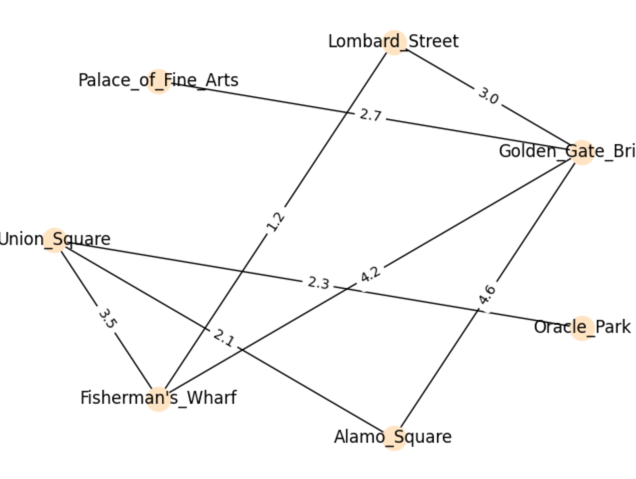

# Граф Транспортної Мережі Сан-Франциско

Проект демонструє обхід графа спрощеного представлення транспортної мережі Сан-Франциско за допомогою алгоритмів DFS (Depth-First Search) та BFS (Breadth-First Search).

## Алгоритм DFS (Depth-First Search)

Алгоритм DFS обходить граф, виходячи в глибину, тобто перш за все відвідує якомога більш віддалені вершини від стартової точки, перш ніж повертатися.

### Кроки обходу за DFS:

1. **Старт з 'Palace_of_Fine_Arts'**: Починаємо обхід з вершини 'Palace_of_Fine_Arts'.
2. **Перехід до 'Golden_Gate_Bridge'**: 'Golden_Gate_Bridge' - єдиний сусід 'Palace_of_Fine_Arts', тому переходимо до нього.
3. **Вибір наступної вершини**: Від 'Golden_Gate_Bridge' обираємо одного з невідвіданих сусідів і рухаємось далі.
   - Процес продовжується аналогічно, відвідуючи кожного сусіда, доки не будуть відвідані всі доступні вершини.

## Алгоритм BFS (Breadth-First Search)

Алгоритм BFS обходить граф, виходячи в ширину, тобто відвідує всі сусідні вершини, перш ніж переходити на наступний рівень.

### Кроки обходу за BFS:

1. **Старт з 'Palace_of_Fine_Arts'**: Починаємо з 'Palace_of_Fine_Arts'.
2. **Відвідування 'Golden_Gate_Bridge'**: Спочатку відвідуємо 'Golden_Gate_Bridge', оскільки це сусідня вершина.
3. **Відвідування наступного рівня сусідів**: Переходимо до сусідів 'Golden_Gate_Bridge' - 'Fisherman's_Wharf', 'Alamo_Square' і 'Lombard_Street'.
   - Процес продовжується з відвідуванням всіх сусідніх вершин на кожному рівні, перш ніж переходити до наступного рівня.
